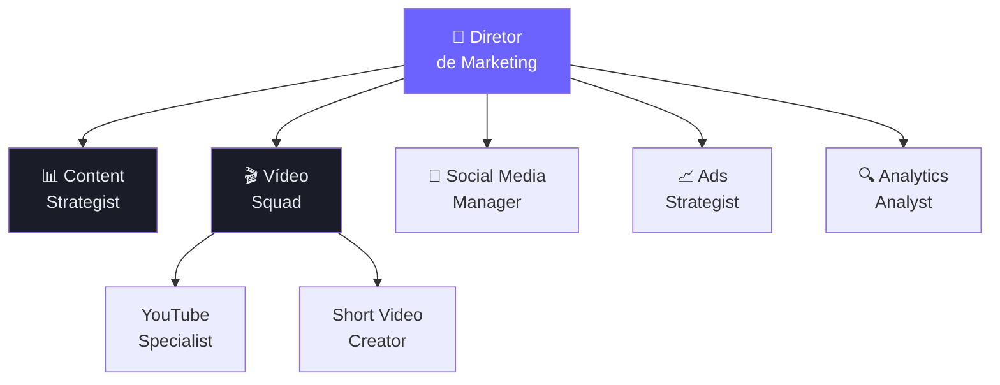
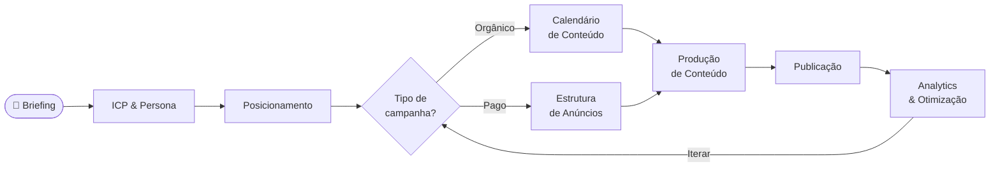
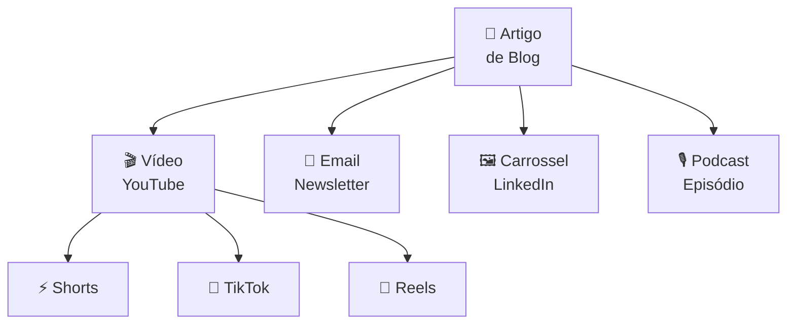
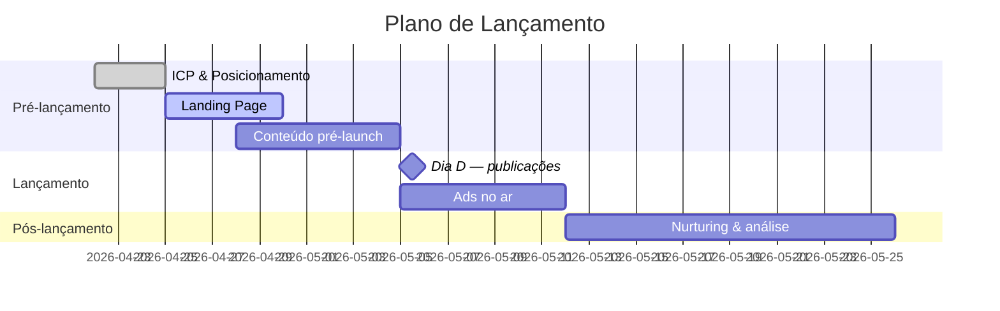
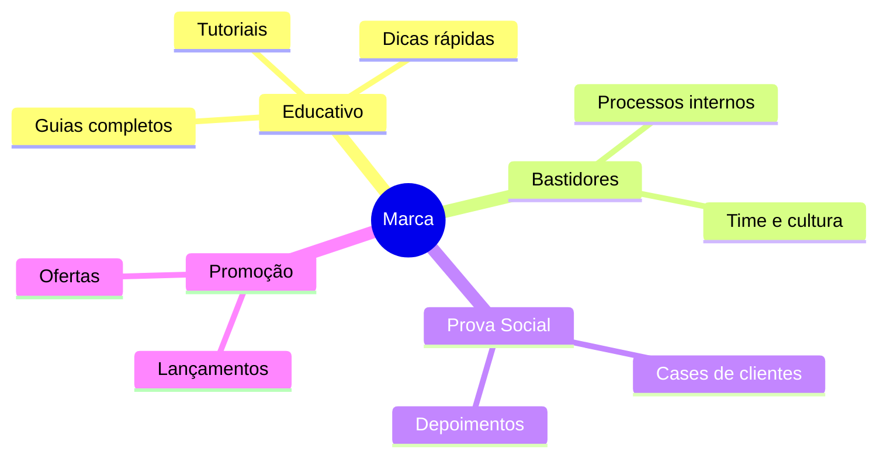
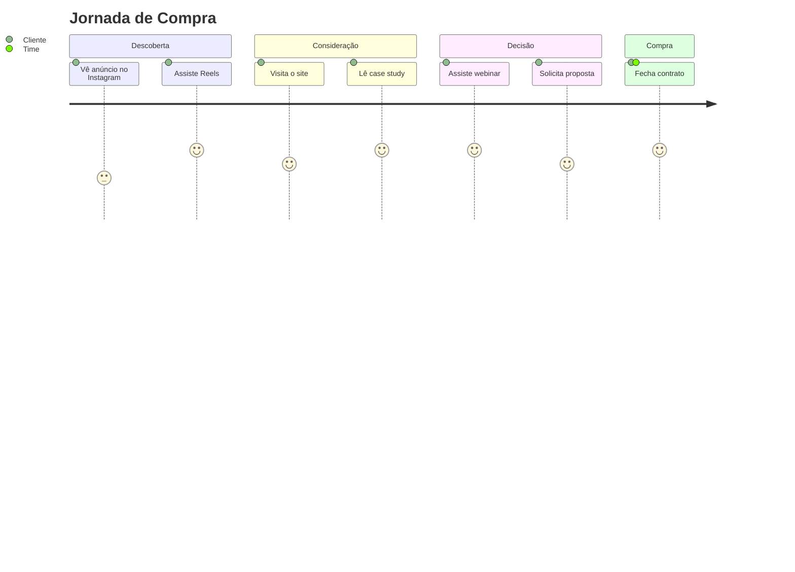

# Diagrama — Organogramas, Workflows e Processos

Gera diagramas visuais usando **Mermaid.js** (texto puro que vira imagem) e **Python** para gráficos de dados. Zero custo, zero instalação extra.

## Ferramentas gratuitas

| Ferramenta | Tipo | Renderiza em |
|-----------|------|-------------|
| **Mermaid.js** | Flowcharts, org charts, sequência, Gantt | GitHub, Notion, VSCode, Obsidian |
| **draw.io** (diagrams.net) | Qualquer diagrama visual | Web, desktop (grátis) |
| **Excalidraw** | Estilo hand-drawn | Web (excalidraw.com — grátis) |
| **Python matplotlib** | Gráficos de dados | Local (grátis) |
| **Canva Free** | Organogramas visuais | Web |

**Recomendação padrão: Mermaid.js** — escreva código, Cole no GitHub/Notion e vira diagrama automaticamente.

---

## Tipos de diagrama e quando usar

| Tipo | Use para | Sintaxe Mermaid |
|------|---------|----------------|
| Flowchart | Processos, fluxos de decisão | `flowchart TD` |
| Organograma | Times, hierarquias | `flowchart TB` com subgraphs |
| Sequência | Interações entre sistemas/pessoas | `sequenceDiagram` |
| Gantt | Cronograma de projetos | `gantt` |
| Mindmap | Brainstorming, pilares de conteúdo | `mindmap` |
| Quadrante | Priorização (ICE, 2x2) | `quadrantChart` |
| Jornada | Customer journey | `journey` |

---

## Templates prontos

### Organograma de time


### Fluxo de campanha


### Pipeline de conteúdo (repurposing)


### Gantt de lançamento


### Mindmap de pilares de conteúdo


### Jornada do cliente


---

## Como gerar e entregar

1. Identifique o tipo de diagrama necessário
2. Colete as informações (times, etapas, entidades)
3. Gere o código Mermaid
4. Salve em arquivo `.md` — Cole no GitHub/Notion para renderizar
5. Para gráficos de dados: gere script Python com matplotlib

## Gráfico de dados com Python (grátis)

```python
import matplotlib.pyplot as plt
import matplotlib
matplotlib.rcParams['figure.facecolor'] = '#0f1117'
matplotlib.rcParams['axes.facecolor'] = '#1a1d27'
matplotlib.rcParams['text.color'] = '#e8eaf0'

canais = ['Instagram', 'YouTube', 'TikTok', 'Facebook']
engajamento = [4.2, 3.8, 7.1, 1.9]
cores = ['#6c63ff', '#00d4aa', '#f59e0b', '#3b82f6']

plt.figure(figsize=(10, 5))
plt.bar(canais, engajamento, color=cores, edgecolor='none')
plt.title('Taxa de Engajamento por Canal (%)', fontsize=14, pad=15)
plt.ylabel('Engajamento (%)')
plt.savefig('engajamento-canais.png', dpi=150, bbox_inches='tight')
print("Gráfico salvo.")
```

## Como renderizar Mermaid localmente (grátis)

```bash
# Opção 1: extensão VSCode "Markdown Preview Mermaid Support"
# Opção 2: copie o código em mermaid.live (editor online grátis)
# Opção 3: cole em bloco ```mermaid no GitHub ou Notion
```
