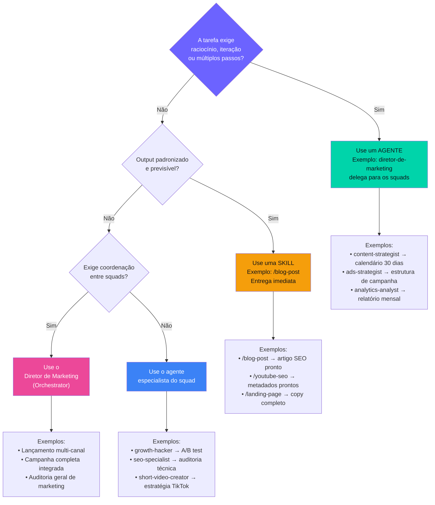
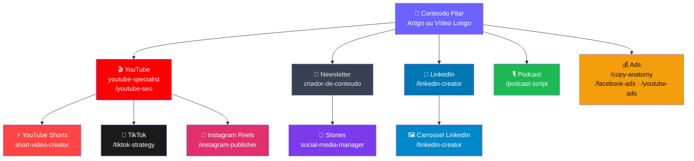

# Diagramas Estratégicos — Time de Marketing Digital

> Renderize colando no GitHub, Notion, VSCode (extensão Mermaid) ou em [mermaid.live](https://mermaid.live)

---

## 1. Estrutura Completa: Estratégica → Tática → Operacional

```mermaid
flowchart TB
    %% ─── CAMADA ESTRATÉGICA ───
    subgraph ESTRATEGIA["🧭  CAMADA ESTRATÉGICA"]
        DIR["🎯 DIRETOR DE MARKETING\ndiretor-de-marketing\n─────────────────────\nOrchestrator · CMO\nVisão 360° · Priorização\nDelegação ao time"]
        SK_EST["Skills estratégicas\n/icp-persona · /posicionamento\n/content-calendar · /produto-gtm"]
        DIR --- SK_EST
    end

    %% ─── CAMADA TÁTICA ───
    subgraph TATICA["⚙️  CAMADA TÁTICA — 5 SQUADS"]
        subgraph S1["Squad 1 · Conteúdo Longo"]
            A1["content-strategist"]
            A2["seo-specialist"]
            A3["criador-de-conteudo"]
        end
        subgraph S2["Squad 2 · Vídeo"]
            B1["youtube-specialist"]
            B2["short-video-creator"]
        end
        subgraph S3["Squad 3 · Social Media"]
            C1["social-media-manager"]
        end
        subgraph S4["Squad 4 · Ads & Performance"]
            D1["ads-strategist"]
            D2["growth-hacker"]
        end
        subgraph S5["Squad 5 · Analytics"]
            E1["analytics-analyst"]
        end
    end

    %% ─── CAMADA OPERACIONAL ───
    subgraph OPERACIONAL["🛠️  CAMADA OPERACIONAL — 32 SKILLS"]
        subgraph OP1["Conteúdo Longo (7)"]
            direction LR
            OP1A["/blog-post · /white-paper · /case-study\n/ebook-outline · /webinar-script\n/podcast-script · /infographic-brief"]
        end
        subgraph OP2["Vídeo (3)"]
            direction LR
            OP2A["/video-script · /youtube-seo · /tiktok-strategy"]
        end
        subgraph OP3["Social Media (5)"]
            direction LR
            OP3A["/instagram-publisher · /linkedin-creator\n/facebook-strategy · /community-engagement\n/influencer-outreach"]
        end
        subgraph OP4["Copy & Ads (7)"]
            direction LR
            OP4A["/copy-anatomy · /landing-page · /press-release\n/facebook-ads · /youtube-ads\n/tiktok-ads · /performance-marketing"]
        end
        subgraph OP5["Analytics & Utils (4)"]
            direction LR
            OP5A["/analytics-report · /seo-audit\n/scraping · /diagrama"]
        end
    end

    %% ─── CONEXÕES VERTICAIS ───
    DIR --> S1
    DIR --> S2
    DIR --> S3
    DIR --> S4
    DIR --> S5

    S1 --> OP1
    S2 --> OP2
    S3 --> OP3
    S4 --> OP4
    S5 --> OP5

    %% ─── ESTILOS ───
    style ESTRATEGIA fill:#1e1b4b,stroke:#6c63ff,color:#e8eaf0
    style TATICA fill:#0f2027,stroke:#00d4aa,color:#e8eaf0
    style OPERACIONAL fill:#1a0f0f,stroke:#f59e0b,color:#e8eaf0
    style DIR fill:#6c63ff,color:#fff
    style SK_EST fill:#3730a3,color:#c7d2fe
    style S1 fill:#164e63,stroke:#00d4aa
    style S2 fill:#164e63,stroke:#00d4aa
    style S3 fill:#164e63,stroke:#00d4aa
    style S4 fill:#164e63,stroke:#00d4aa
    style S5 fill:#164e63,stroke:#00d4aa
    style OP1 fill:#431407,stroke:#f59e0b
    style OP2 fill:#431407,stroke:#f59e0b
    style OP3 fill:#431407,stroke:#f59e0b
    style OP4 fill:#431407,stroke:#f59e0b
    style OP5 fill:#431407,stroke:#f59e0b
```

---

## 2. Fluxo Completo de Campanha

```mermaid
flowchart LR
    START([🚀 Nova Campanha]) --> E1

    subgraph FASE1["1️⃣  Estratégia"]
        E1["/icp-persona\nQuem é o público?"]
        E2["/posicionamento\nQual a mensagem?"]
        E3["/content-calendar\nComo distribuir?"]
        E1 --> E2 --> E3
    end

    subgraph FASE2["2️⃣  Planejamento"]
        P1{"Tipo de\ncampanha?"}
        P2["Lançamento\n/produto-gtm"]
        P3["Conteúdo\nOrgânico"]
        P4["Mídia\nPaga"]
        E3 --> P1
        P1 -->|produto novo| P2
        P1 -->|conteúdo| P3
        P1 -->|ads| P4
    end

    subgraph FASE3["3️⃣  Produção"]
        PR1["Conteúdo Longo\n/blog-post /white-paper\n/case-study /ebook-outline\n/webinar-script /podcast-script"]
        PR2["Vídeo\n/video-script /youtube-seo\n/tiktok-strategy"]
        PR3["Social Media\n/instagram-publisher\n/linkedin-creator\n/facebook-strategy"]
        PR4["Copy & Ads\n/copy-anatomy /landing-page\n/facebook-ads /youtube-ads\n/tiktok-ads"]
        P2 --> PR1
        P3 --> PR1 & PR2 & PR3
        P4 --> PR4
    end

    subgraph FASE4["4️⃣  Publicação"]
        PB1["Meta Business Suite\nInstagram · Facebook"]
        PB2["YouTube Studio\nYouTube · Shorts"]
        PB3["TikTok Creator Studio\nTikTok"]
        PB4["LinkedIn / Blog\nLinkedIn · Site"]
        PR1 --> PB4
        PR2 --> PB1 & PB2 & PB3
        PR3 --> PB1
        PR4 --> PB1 & PB2 & PB3
    end

    subgraph FASE5["5️⃣  Analytics & Otimização"]
        AN1["/analytics-report\nGA4 · Search Console\nMeta · YouTube · TikTok"]
        AN2["/seo-audit\nSEO on-page"]
        AN3["/scraping\nIntelligência competitiva"]
        OTM["🔄 Otimizar\nA/B tests · ICE scoring\ngrowth-hacker"]
        PB1 & PB2 & PB3 & PB4 --> AN1
        AN1 --> AN2 & AN3
        AN1 --> OTM
        OTM -->|iterar| P1
    end

    style START fill:#6c63ff,color:#fff
    style FASE1 fill:#1e1b4b,stroke:#6c63ff
    style FASE2 fill:#0f2027,stroke:#00d4aa
    style FASE3 fill:#1a1a0f,stroke:#f59e0b
    style FASE4 fill:#0f1a0f,stroke:#22c55e
    style FASE5 fill:#1a0f1a,stroke:#ec4899
    style OTM fill:#7c3aed,color:#fff
```

---

## 3. Mapa de Decisão — Agente ou Skill?

---

## 4. Pipeline de Repurposing de Conteúdo

---

## Legenda de Componentes

| Tipo | Como chamar | Quando usar |
|------|------------|-------------|
| **Agente Orquestrador** | `diretor-de-marketing` | Campanhas completas, decisão estratégica |
| **Agente Especialista** | Nome do agente (ex: `ads-strategist`) | Tarefa complexa dentro de um squad |
| **Skill** | `/nome-da-skill` (ex: `/blog-post`) | Output rápido e padronizado |
| **Script Python** | `python credentials/ga4_report.py` | Dados reais de GA4 e Search Console |
